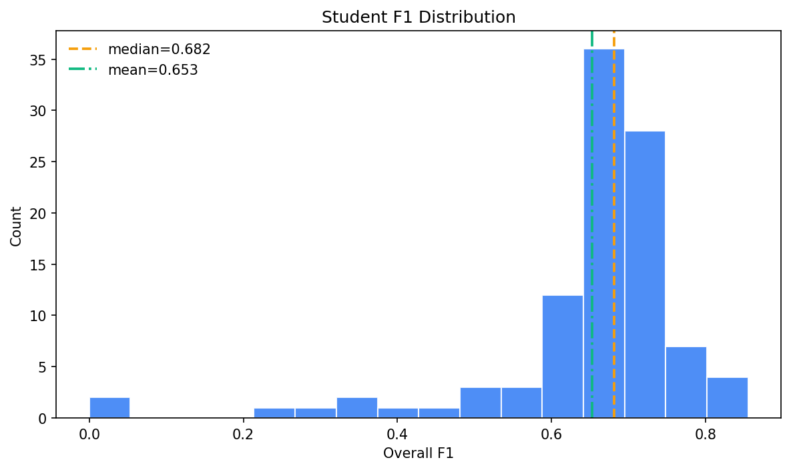
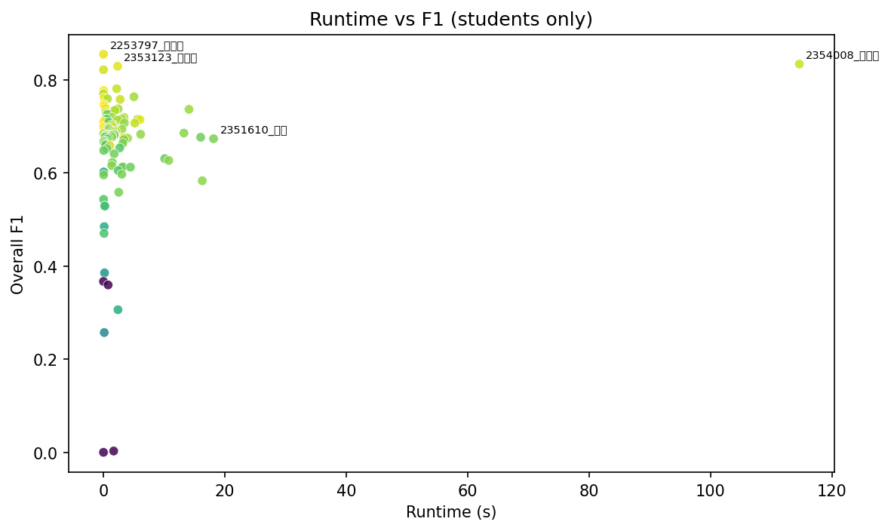
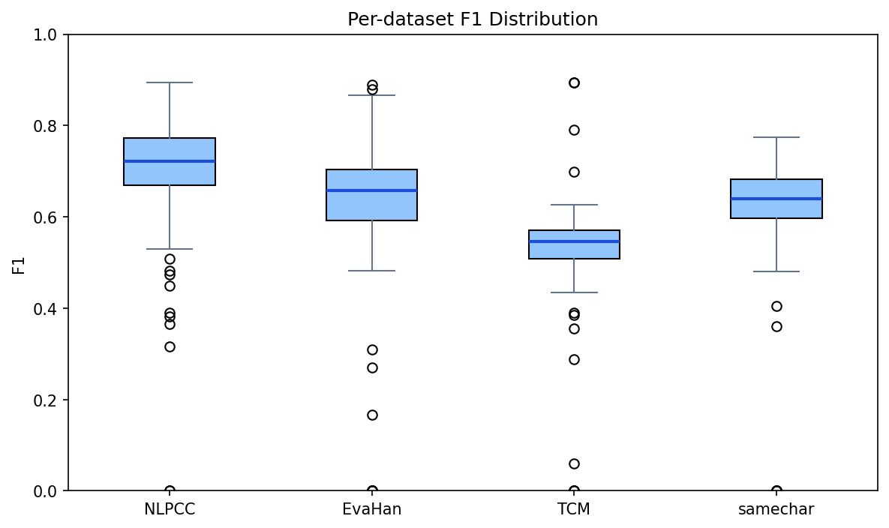
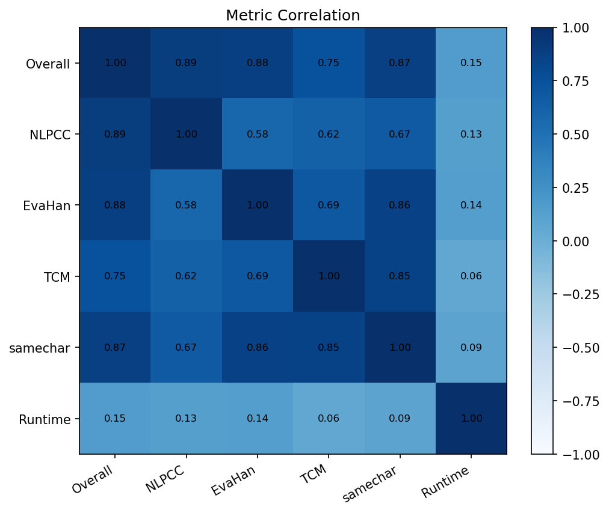
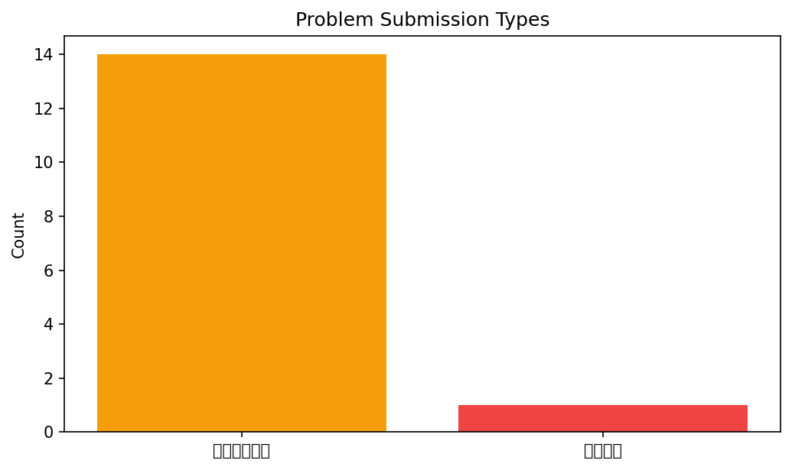

# 课堂学生提交 EDA 报告

## 一、数据预处理

### 1.1 数据来源

- 排行榜主表：`my_platform/results/leaderboard.csv`
- 学生提交详情：`my_platform/results/reports/`
- 问题提交清单：`my_platform/results/problem_submissions.csv`
- 课堂评测包：`test_assets/platform_eval_v2_draft/`

### 1.2 预处理步骤

1. 仅保留 `submission_group=课堂提交` 的记录，去掉工具基线与 AI 对比结果。
2. 对重复提交名按最高分保留一条记录，避免重复统计。
3. 将总体 F1、分子集 F1、运行时间统一转为数值型。
4. 对个别行不匹配但整体可对齐的提交，采用“问题句记 0 分，其余句正常评分”的容错策略。
5. 单独记录问题提交类型，便于课堂讲评。

### 1.3 数据规模

- 学生提交数：**101**
- 带问题提示提交：**15**

## 二、描述性统计

- 总体 F1 均值：**0.6526**
- 总体 F1 中位数：**0.6818**
- 总体 F1 标准差：**0.1371**
- 运行时间中位数：**1.3590 s**
- 最高 F1：**0.8554**
- 最低 F1：**0.0000**

总体分数主要集中在 0.60~0.76 区间，右侧存在少量高分提交，说明这套测试集仍然具有较好的区分能力。运行时间离散程度明显大于分数离散程度，说明不同提交在工程实现上差异较大。

## 三、图形化结果

### 3.1 总体 F1 分布

### 3.2 运行时间与效果关系

散点图显示，运行时间和 F1 的关系并不强。也就是说，程序更慢不一定更准，更快也不一定更差。当前差距更多来自分词策略和工程处理方式，而不是单纯计算量。

### 3.3 各子集 F1 分布

箱线图说明，`NLPCC` 和 `samechar` 的离散程度较大，`TCM` 整体分数偏低，`EvaHan` 中位数相对稳定。这表明各子集考察的能力差异很大。

### 3.4 指标相关性

总体 F1 与 `NLPCC`、`EvaHan`、`samechar` 的相关都较高，其中与 `NLPCC` 的相关最高，说明当前总榜仍然最容易受现代文本子集影响。

### 3.5 问题提交类型

问题提交几乎都集中在“原句还原问题”，说明当前最主要的失败点并不是算法完全不会分词，而是输出协议没有守住。

## 四、分子集分析

- `NLPCC` 平均 F1：**0.6900**
- `EvaHan` 平均 F1：**0.6235**
- `TCM` 平均 F1：**0.5250**
- `samechar专项` 平均 F1：**0.6171**

从均值看，`TCM` 仍然是最弱的一桶，说明术语边界和古籍表达还是当前学生实现最容易掉分的点。`samechar专项` 的波动也较大，说明重复字和句义歧义仍然能拉开差距。

## 五、异常值与稳定性

- 高分异常值数量（IQR）：**3**
- 低分异常值数量（IQR）：**11**

高分异常值不多，说明领先提交数量有限；低分异常值多数伴随协议问题或极端错误输出，而不只是普通分词偏差。

## 六、共性错例归因分析

### 6.1 NLPCC

- 行号：**1**
- 原句：伯克希尔哈撒韦公司今年一季度净收入55.9亿美元，同比增长8.2%，旗下BNSF铁路净收入同比下降25%至7.84亿美元，创两年新低；
- 标准切分：伯克希尔 / 哈撒韦 / 公司 / 今年 / 一季度 / 净 / 收入 / 55.9亿 / 美元 / ， / 同比 / 增长 / 8.2% / ， / 旗下 / BNSF / 铁路 / 净 / 收入 / 同比 / 下降 / 25% / 至 / 7.84亿 / 美元 / ， / 创 / 两 / 年 / 新 / 低 / ；
- 预测样例（2352627_梁凯毅）：伯克 / 希尔哈撒韦 / 公司 / 今年 / 一 / 季度 / 净 / 收入 / 55 / . / 9亿 / 美元 / ， / 同比 / 增长 / 8 / . / 2 / % / ， / 旗 / 下 / B / N / S / F / 铁路 / 净 / 收入 / 同比 / 下降 / 2 / 5 / % / 至 / 7 / . / 84亿 / 美元 / ， / 创 / 两 / 年 / 新低 / ；
- 预测样例（2352753_霍子轩）：伯克希尔哈撒韦 / 公司 / 今年一季度 / 净收入 / 55 / .9亿美元 / ， / 同比 / 增长 / 8. / 2% / ， / 旗 / 下 / BNSF / 铁路 / 净收入 / 同比 / 下降 / 2 / 5% / 至 / 7 / . / 8 / 4亿美元 / ， / 创 / 两年 / 新 / 低 / ；
- 预测样例（2353911_李浩瑞）：伯克 / 希尔 / 哈撒韦 / 公司 / 今年 / 一 / 季 / 度净 / 收入 / 55 / .9亿 / 美元 / ， / 同比 / 增长 / 8 / .2% / ， / 旗 / 下 / BN / SF / 铁路 / 净收入 / 同比 / 下 / 降25 / %至7 / .84亿 / 美元 / ， / 创 / 两 / 年 / 新低 / ；
- 归因分析：这一句集中暴露了金额、百分比和英文缩写的切分问题。很多提交把 `55.9亿`、`BNSF`、`25%`、`7.84亿` 拆得过细，说明数字串、缩写串和单位串的整体保护不足。

### 6.2 EvaHan

- 行号：**139**
- 原句：舆地纪胜曰：丹阳在今归州秭归县东八里屈沱楚王城是也。余按楚遣屈丐伐秦，秦发兵逆击之，枝江之丹阳则距郢逼近，秭归之丹阳则不当秦、楚之路。索隱因下文遂取汉中，即谓丹阳在汉中，皆非也。此丹阳谓丹水之阳。班志：丹水出上洛冢岭山，东至析入钧水，其水盖在弘农丹水、析两县之间，武关之外也。秦、楚交战当在此水之阳。楚师既败，秦师乘胜取上庸路西入以收汉中，其势易矣。索，山客翻。
- 标准切分：舆地纪胜 / 曰 / ： / 丹阳 / 在 / 今 / 归州 / 秭归县 / 东 / 八里 / 屈沱 / 楚王城 / 是 / 也 / 。 / 余 / 按 / 楚遣 / 屈丐 / 伐 / 秦 / ， / 秦 / 发兵 / 逆击 / 之 / ， / 枝江 / 之 / 丹阳 / 则 / 距 / 郢 / 逼近 / ， / 秭归 / 之 / 丹阳 / 则 / 不 / 当 / 秦 / 、 / 楚 / 之 / 路 / 。 / 索隱 / 因 / 下文 / 遂 / 取 / 汉中 / ， / 即 / 谓 / 丹阳 / 在 / 汉中 / ， / 皆 / 非 / 也 / 。 / 此 / 丹阳 / 谓 / 丹水 / 之 / 阳 / 。 / 班志 / ： / 丹水 / 出 / 上洛 / 冢岭山 / ， / 东 / 至 / 析 / 入 / 钧水 / ， / 其 / 水 / 盖 / 在 / 弘农 / 丹水 / 、 / 析 / 两县 / 之 / 间 / ， / 武关 / 之 / 外 / 也 / 。 / 秦 / 、 / 楚 / 交战 / 当 / 在 / 此 / 水 / 之 / 阳 / 。 / 楚师 / 既 / 败 / ， / 秦师 / 乘胜 / 取 / 上庸路 / 西 / 入 / 以 / 收 / 汉中 / ， / 其 / 势 / 易 / 矣 / 。 / 索 / ， / 山客 / 翻 / 。
- 预测样例（2352627_梁凯毅）：舆 / 地 / 纪胜曰 / ： / 丹阳 / 在 / 今 / 归州 / 秭归县 / 东八 / 里 / 屈沱 / 楚 / 王 / 城是 / 也 / 。 / 余 / 按 / 楚遣 / 屈丐 / 伐秦 / ， / 秦 / 发兵 / 逆击 / 之 / ， / 枝江 / 之 / 丹阳 / 则 / 距 / 郢 / 逼近 / ， / 秭归 / 之 / 丹阳 / 则 / 不 / 当 / 秦 / 、 / 楚 / 之 / 路 / 。 / 索隱 / 因 / 下 / 文遂 / 取汉 / 中 / ， / 即谓 / 丹阳 / 在 / 汉中 / ， / 皆非 / 也 / 。 / 此 / 丹阳 / 谓 / 丹水 / 之 / 阳 / 。 / 班志 / ： / 丹水 / 出 / 上 / 洛冢岭山 / ， / 东 / 至 / 析入 / 钧水 / ， / 其 / 水盖 / 在 / 弘农丹水 / 、 / 析 / 两 / 县 / 之间 / ， / 武关 / 之外 / 也 / 。 / 秦 / 、 / 楚交战 / 当 / 在 / 此 / 水 / 之 / 阳 / 。 / 楚师 / 既 / 败 / ， / 秦师 / 乘 / 胜 / 取 / 上 / 庸路 / 西入 / 以 / 收汉 / 中 / ， / 其 / 势易 / 矣 / 。 / 索 / ， / 山 / 客翻 / 。
- 预测样例（2352753_霍子轩）：舆地 / 纪胜 / 曰 / ： / 丹阳 / 在今 / 归州 / 秭归县 / 东八里 / 屈沱 / 楚 / 王城 / 是 / 也 / 。余 / 按楚 / 遣 / 屈 / 丐 / 伐 / 秦 / ， / 秦 / 发 / 兵 / 逆击 / 之 / ， / 枝江 / 之 / 丹阳 / 则 / 距 / 郢 / 逼近 / ， / 秭归 / 之 / 丹阳 / 则 / 不 / 当 / 秦 / 、 / 楚 / 之 / 路 / 。 / 索隱 / 因 / 下 / 文 / 遂 / 取 / 汉 / 中 / ， / 即 / 谓 / 丹阳 / 在 / 汉 / 中 / ， / 皆 / 非 / 也 / 。 / 此 / 丹 / 阳谓 / 丹水 / 之 / 阳 / 。 / 班志 / ： / 丹水 / 出 / 上 / 洛 / 冢 / 岭 / 山 / ， / 东 / 至 / 析 / 入 / 钧水 / ， / 其 / 水盖 / 在 / 弘 / 农 / 丹水 / 、 / 析 / 两 / 县 / 之间 / ， / 武关 / 之外 / 也 / 。 / 秦 / 、 / 楚 / 交战 / 当 / 在 / 此 / 水 / 之 / 阳 / 。 / 楚 / 师 / 既 / 败 / ， / 秦 / 师 / 乘 / 胜取 / 上庸 / 路 / 西 / 入 / 以 / 收汉 / 中 / ， / 其 / 势易 / 矣 / 。 / 索 / ， / 山 / 客 / 翻 / 。
- 预测样例（2353911_李浩瑞）：舆地 / 纪胜 / 曰 / ： / 丹阳 / 在 / 今归州 / 秭归县 / 东八 / 里 / 屈沱 / 楚 / 王 / 城 / 是 / 也 / 。 / 余 / 按楚 / 遣屈 / 丐伐 / 秦 / ， / 秦 / 发兵逆击之 / ， / 枝江 / 之 / 丹阳 / 则 / 距 / 郢 / 逼近 / ， / 秭归 / 之 / 丹阳 / 则 / 不 / 当 / 秦 / 、 / 楚 / 之 / 路 / 。 / 索隱 / 因 / 下 / 文遂 / 取汉 / 中 / ， / 即谓 / 丹阳 / 在 / 汉 / 中 / ， / 皆非 / 也 / 。 / 此 / 丹阳谓 / 丹水 / 之 / 阳 / 。 / 班志 / ： / 丹水 / 出 / 上 / 洛冢岭山 / ， / 东至析 / 入 / 钧水 / ， / 其 / 水盖 / 在 / 弘 / 农 / 丹水 / 、 / 析 / 两 / 县 / 之间 / ， / 武 / 关之外 / 也 / 。 / 秦 / 、 / 楚 / 交战 / 当 / 在 / 此水 / 之 / 阳 / 。 / 楚 / 师既败 / ， / 秦师 / 乘胜取 / 上 / 庸路 / 西入 / 以 / 收汉 / 中 / ， / 其 / 势 / 易 / 矣 / 。 / 索 / ， / 山客 / 翻 / 。
- 归因分析：这是古汉语长句。少数提交在这一句已经不是单纯分词偏差，而是出现了字符替换或提示词混入，说明长句场景下输入输出契约更容易被破坏。

### 6.3 TCM

- 行号：**185**
- 原句：仙家有贮石莲子及干藕经千年者，食之不饥，轻身能飞，至妙
- 标准切分：仙家 / 有 / 贮 / 石莲子 / 及 / 干藕 / 经 / 千年 / 者 / ， / 食之不饥 / ， / 轻身 / 能飞 / ， / 至妙
- 预测样例（2352627_梁凯毅）：仙家 / 有 / 贮石 / 莲子 / 及 / 干藕 / 经千 / 年 / 者 / ， / 食之不饥 / ， / 轻身 / 能 / 飞 / ， / 至 / 妙
- 预测样例（2352753_霍子轩）：仙家 / 有 / 贮 / 石 / 莲子 / 及 / 干 / 藕 / 经 / 千年 / 者 / ， / 食 / 之 / 不饥 / ， / 轻身 / 能 / 飞 / ， / 至 / 妙
- 预测样例（2353911_李浩瑞）：仙家 / 有 / 贮 / 石莲子 / 及 / 干 / 藕 / 经千 / 年 / 者 / ， / 食 / 之 / 不 / 饥 / ， / 轻身能 / 飞 / ， / 至妙
- 归因分析：这一类错例通常出现在术语、剂量结构和古籍短语附近。许多提交会把药名、方名和剂量拆散，说明领域词块整体性仍然不够稳。

### 6.4 samechar专项

- 行号：**210**
- 原句：你等一会会会会会会计的人吗？
- 标准切分：你 / 等 / 一会 / 会 / 会会 / 会 / 会计 / 的 / 人 / 吗 / ？
- 预测样例（2352627_梁凯毅）：你 / 等 / 一会 / 会会 / 会会 / 会计 / 的 / 人 / 吗 / ？
- 预测样例（2352753_霍子轩）：你 / 等 / 一 / 会 / 会 / 会 / 会会 / 会计 / 的 / 人 / 吗 / ？
- 预测样例（2353911_李浩瑞）：你 / 等 / 一 / 会 / 会 / 会 / 会 / 会 / 会计 / 的 / 人 / 吗 / ？
- 归因分析：samechar 专项更依赖句义和重复字模式。共性错误通常不是完全不会切，而是在重复字附近做出看似合理但与标准不一致的边界。

## 七、结论

这次学生提交的 EDA 结果说明，当前课堂评测最能拉开差距的仍然是 mixed-script、数字单位串、古汉语长句和 samechar 这几类样本。学生之间的主要差距，一部分来自分词策略本身，另一部分来自是否严格遵守输出协议。对课堂讲评来说，只看总分不够，最好同时结合分子集得分、问题清单和共性错例一起解释。
